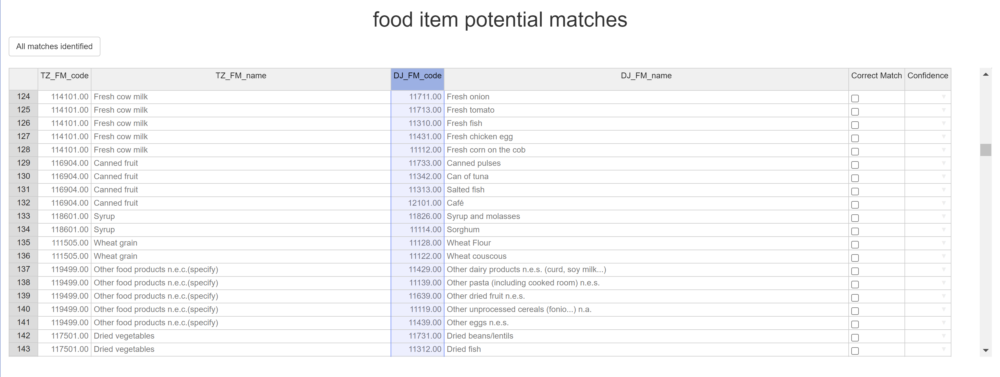
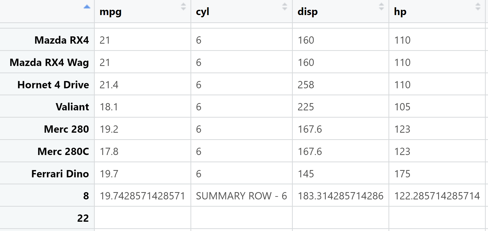

### Overview
**NutritionTools** is an R package of functions to help with a wide range of calculations and processes that commonly occur when working with nutrition datasets. The goal behind the development was not to automatically do the work, but rather to help nutritionists and data scientists to complete these tasks more quickly while remaining in full control of the decisions being made, with clear notation of the decisions made at every step.

Currently **NutritionTools** offers 6 tools to help with 4 key areas;
Nutritional Calculations, Food Matching, Food Dataset Management, and Output
Summaries, although further functions are still in development and are set to be
added at a later time. 

{width="150"
style="float:right"} **NutritionTools** has been developed through work at the [Micronutrient Action Policy Support (MAPS)](https://www.micronutrient.support/) Project, although the
use of these tools is widely encouraged by all who might find them useful and
use is not exclusive to the MAPS project.

### Installation
You can install the latest version of this package from github by
running the following lines of code:
``` r
if (!require("devtools")) {
  install.packages("devtools")
}
devtools::install_github("TomCodd/NutritionTools")
```
### Getting started 
### Resources
-   [Open an issue](https://github.com/TomCodd/NutritionTools/issues/new) (GitHub issues for bug reports, feature requests, and function requests)

### Examples 
Some quick examples of various function interfaces or outputs.
First is the main interface of the Fuzzy_Matcher Tool, highlighting potential
matches across different nutritional datasets.
``` r
Fuzzy_Output <- Fuzzy_Matcher(TZ_FM, DJ_FM)
```
{width="1000"} Next is an output from the
Group Summariser. This is less specific to nutrition and so it is possible to
give an example of its functionality using some of R's built-in datasets, to
summarise car data, grouped by the number of cylinders.
``` r
mtcars_grouped_averages <- Group_Summariser(df = mtcars, group_ID_col = 'cyl', sep_row = T, round_weighting = T)
print(mtcars_grouped_averages)
```
{width="1000"}
