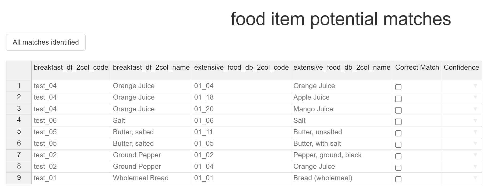
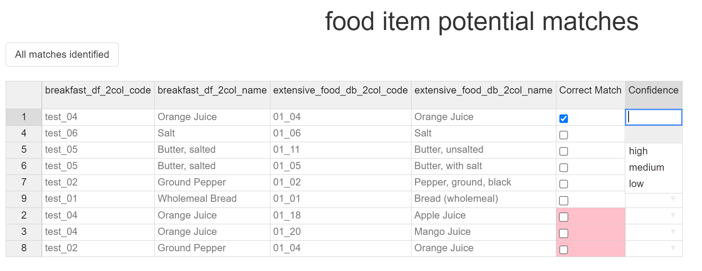
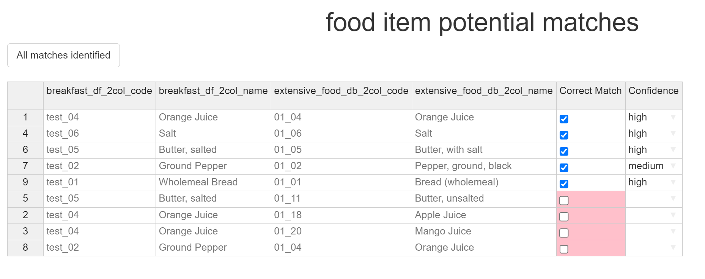

```{r, include = FALSE}
knitr::opts_chunk$set(
  collapse = TRUE,
  comment = "#>"
)
```

# Fuzzy Matcher Guide

## Introduction

Because of the Fuzzy Matchers GUI interface, the standard R function documentation is ill-suited to helping with its use. Instead this guide has been created to guide you through using this function.

## Data Prep

The first step of using the Fuzzy Matcher is to prepare the datasets you would like to match. The Fuzzy Matcher requires two different data frames as its input, with an optional key word. In this example, we will create two data frames and then match items between them.

### R setup

First we load the required packages. NutritionTools is this package, which contains Fuzzy Matcher, which we need. dplyr is a package which is widely used and contains many useful tools. It is also a dependency of NutritionTools, so should already be installed on your system. Because some of the data prep methods can be done with dplyr instead of base R, both methods will be shown - requiring it to be called now.

```{r eval = FALSE, setup}
library(NutritionTools)
library(dplyr)
```

Then, we will create two example data frames - breakfast_df and extensive_food_db. These will be the data frames we are matching against.

```{r, data generation}
breakfast_df <-
  data.frame(
    "ID" = c(
      "test_01",
      "test_02",
      "test_03",
      "test_04",
      "test_05",
      "test_06",
      "test_07"
    ),
    "food_name" = c(
      "Wholemeal Bread",
      "Ground Pepper",
      "whole milk",
      "Orange Juice",
      "Butter, salted",
      "Salt",
      "Eggs"
    ),
    "CART B (mcg)" = c(NA, 105, "", 130, NA, "", 111),
    "CART A (mcg)" = c(0, 35, 23, 27, 6, 34, NA),
    "CRYPXB (mcg)" = c(110, 67, 72, NA, 160, 102, 98),
    "CART B eq (std) (mcg)" = c("", 107, 102, NA, "", NA, 72),
    "CART B eq (mcg)" = c(159, 103, 132, NA, "", "", ""),
    "Vit A RAE (mcg)" = c(13, 8, NA, 15, 13, NA, NA),
    "Vit A (mcg)" = c(12, 11, 8, 13, 3, 1, 10),
    "Retinol (mcg)" = c(0, 7, 12, NA, 5, 2, 10),
    "comments" = c(
      "Imaginary values",
      "Completely fictional values",
      "Fictional values #2",
      "More fictional values",
      "Fictional #4",
      "Fictional no. 5",
      "fictional 6"
    ), check.names = F
  )

extensive_food_db <- data.frame(
    "item_ID" = c(
      "01_01",
      "01_02",
      "01_03",
      "01_04",
      "01_05",
      "01_06",
      "01_07",
      "01_08",
      "01_09",
      "01_10",
      "01_11",
      "01_12",
      "01_13",
      "01_14",
      "01_15",
      "01_16",
      "01_17",
      "01_18",
      "01_19",
      "01_20"
    ),
    "food_item_name" = c(
      "Bread (wholemeal)",
      "Pepper, ground, black",
      "Milk, cow, whole, fresh, raw",
      "Orange Juice",
      "Butter, with salt",
      "Salt",
      "Egg, chicken, whole, raw",
      "Bacon",
      "Sausage",
      "Milk, skimmed",
      "Butter, unsalted",
      "Bread (white)",
      "Bread (Brown), wheat flour",
      "Tomato",
      "Mushroom",
      "Parsley",
      "Tomato, tinned",
      "Apple Juice",
      "Pineapple Juice",
      "Mango Juice"
      ),
    "Iron (Fe)" = c(12, 11, 8, 13, 3, 1, 10, 15, 3, 80, 14, 27, 54, 12, 7, 3, 7, 15, 10, 45),
    "Selenium (Se)" = c(0, 35, 23, 27, 6, 34, NA, 23, 10, 8, 6, 15, NA, "", 20, 12, 18, 20, 12, 20),
    "Zinc (Zn)" = c(13, 8, NA, 15, 13, NA, NA, 10, 8, 9, 4, 3, 2, 10, 8, 6, 14, 13, 21, 6),
    "comments" = c(
      "These are imaginary",
      "Really fictional values",
      "Fictional values again",
      "More fictions",
      "imaginary #4",
      "imaginary no. 5",
      "imaginary 6",
      "More fiction",
      "complete fiction",
      "again, fantasy",
      "Fantasy again",
      "once again, imaginary",
      "complete fiction",
      "and again, imaginary",
      "this ones real (only joking)",
      "knock knock",
      "who's there?",
      "cow says",
      "cow says who?",
      "no, cow says moo!"
    ), check.names = F
  )
```

### Data preparation

The Fuzzy Matcher, as mentioned in its description, has certain data frame input requirements - namely that the data frames are both 2 columns in size, with the first column being an ID column, and the second being the food item name. In order to create an ideal data frame, we will subset the 2 original input columns.

#### Subsetting with base R

This first method only use base R functions.

``` r        
breakfast_df_2col <- breakfast_df[,c(1,2)]
extensive_food_db_2col <- extensive_food_db[,c(1,2)]
```

Using the square brackets, we can tell R that we only want two columns, which we have selected to be columns 1 and 2, in that order - because column 1 is the ID column we want, and column 2 is the item name we want. The order of selection is important - if the data frame was set up differently, and the ID column was, for example, in column 4, and the item names in column 1, the command would instead be [,c(4,1)] - the first column in our list is 4 where the ID is, and then the item name column (1).

#### Subsetting with dplyr

This methods make use of the select function in the dplyr package.

``` r
breakfast_df_2col <- breakfast_df %>% select("ID", "food_name")
extensive_food_db_2col <- extensive_food_db %>% select("item_ID", "food_item_name")
```

Using the dplyr select tool, instead of picking the columns we want by the column numbers, we are instead selecting them by the column names - once again selecting the ID column name first, and then the food name column.

Both these methods have identical outputs.

## Calling the Fuzzy Matcher

In order to call the Fuzzy Matcher we simply use the following command:

``` r
Fuzzy_Matcher(df1 = breakfast_df_2col, df2 = extensive_food_db_2col)
```

Deciding which data frame is df1 and which is df2 is important in certain applications. As a general rule the larger dataset should be df2 - the list which items from df1 search through for matches.

Please note: when matching between larger datasets this step can take a few seconds to process before moving on.

### Optional command: focus_term

Once called the Fuzzy Matcher will look at the similarity between each of the food item names and, if potential matches are close enough, will rank the top 5 for you to pick through. There is an additional input command we can use, the focus_term. This is a word you can specify. If specified, if the word appears in a potential match, then the selection requirements for showing that match are reduced. This means that you should have the option to pick from a wider range of items if a food item name contains the focus_term. This is useful if, for example, you need to prioritise matching food items which contain the 'raw' term - more potential matches will be shown. These extra matches are technically ones that the fuzzy matcher doesn't think are as good a match, but they still might give you more options for you to decide between.

If we were to use the focus term in this example, the command would be:

``` r
Fuzzy_Matcher(df1 = breakfast_df_2col, df2 = extensive_food_db_2col, focus_term = "raw")
```

## Matching using the Fuzzy Matcher

Once the potential matches are found, the Fuzzy Matcher will open a pop-up window, with an interactive table in it.





### Selecting Matches

The table contains 7 columns - the ID and item name column of df1, the ID and item name column of df2, a 'Correct Match' tickbox column for you to select the correct potential match from, and a 'Confidence' column for you to select the match confidence from.



Each item from df1 can have up to 5 potential matches from df2 - as we can see in the above image, as Orange Juice has 3 potential matches; Orange Juice, Apple Juice, and Mango Juice. In this case we believe Orange Juice should be matched with Orange Juice, so we select the tickbox in the row which contains this match. As soon as we do this the other potential matches for Orange Juice get dropped to the bottom of the table, and are no longer selectable - this is to prevent accidental multimatching to a single item.


### Match confidences

For each match, a confidence value must be selected. There are 3 potential confidence values for you to pick from - High, Medium, and Low. 


For example, matching *'milk, whole, (cows), raw'* to *'whole, raw cows milk'* might be marked as high confidence - we are sure that all factors of this match are correct. Matching *'whole cows milk'* to *'whole, raw cows milk'* might be a medium confidence match, depending on how important you think it being raw is. Matching *'milk'* to *'whole, raw cows milk'* might be low confidence - we are assuming its cows milk, we're assuming that its whole milk, and we're assuming that its not pasturised. An individual's or organisations definition of what constitutes a high, medium or low match are subjective and potentially use-dependent, but these values should give a good range of potential inputs to pick from.

We believe that the Orange Juice match is a high confidence match, and so that is the option we will pick.


##Finishing the Matching

Once all the correct matches are completed, the table should look something like this:



